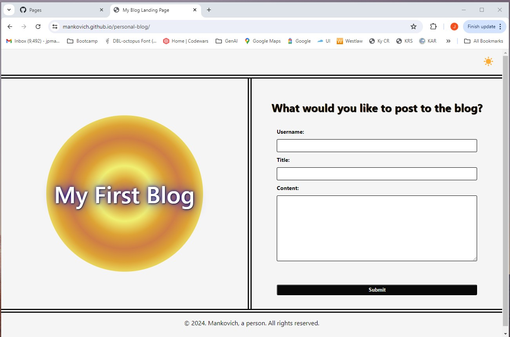
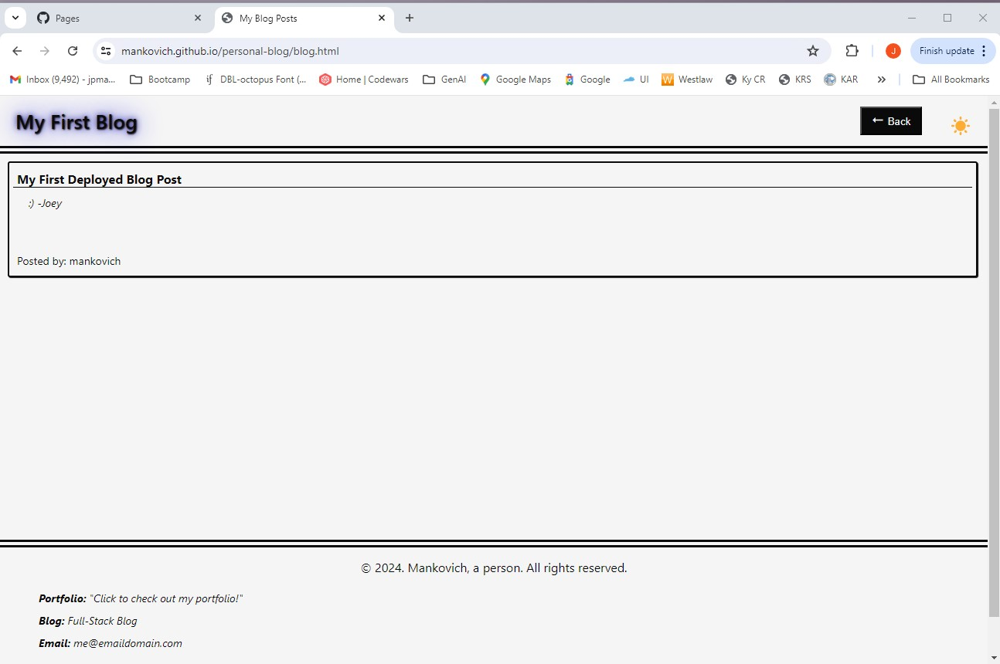
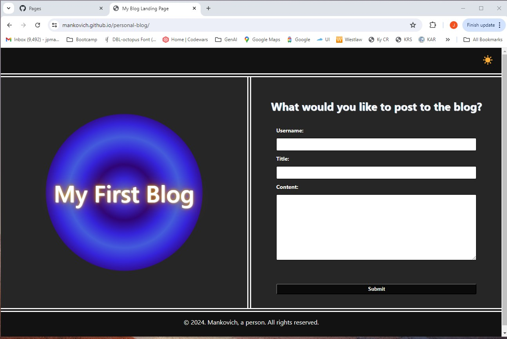
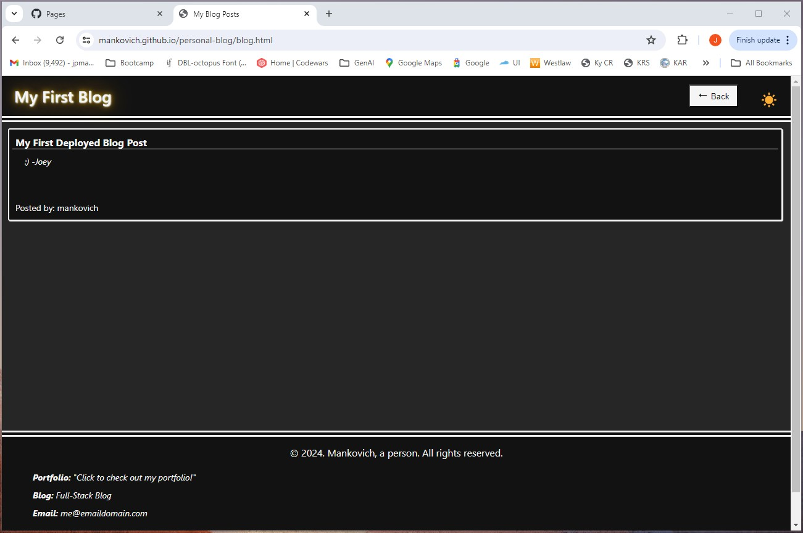

# 04 Web APIs: Personal Blog

## Description of Application

This is a personal-blog web application comprising two pages: a landing page and a blog page.

The landing page contains a form with three text-input boxes for Username, Title, and Content. If the user attempts to submit the form with any of the input's blank, a message is displayed advising that it cannot be left blank. Upon clicking submit of a filled-out form, the user is automatically directed to the blog page in the same browser window. 

On the blog page, the user's blog post is displayed, along with others that have been previously submitted. Each post contains the title, content, and posted-by information provided by the submitting user. There is a back button at the top of the blog page, which when pressed, lands the user back on the first page to allow for submitting new posts. The blog footer provides links to a Portfolio and an email address.

In the upper right-hand corner of both pages, there is a light button that, when pressed, toggles between a light and dark theme for the webpage. 

## Screenshots of Deployed Application

## Links to Deployed Application and GitHub repository

The deployed application may be found [at this link.] (https://mankovich.github.io/personal-blog/)

You may visit my GitHub repository for this application [here.] (https://github.com/mankovich/personal-blog)

---

&copy; 2024 Mankovich, a person. All rights reserved. 